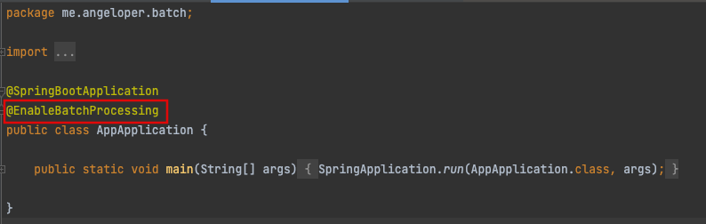
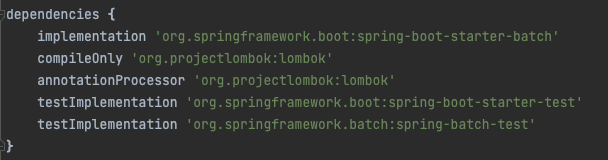

# Spring Batch 시작하기

## Spring Batch 란?

금일은 Spring Batch를 시작하는 방법을 알아보려고 합니다. Spring Batch는 `Batch`의 말에서도 알수 있 듯 큰 작업을 일괄처리 할 수 있는 기능을 의미하며, 보통 Batch의 경우에는 사용자의 사용량이 적은 새벽시간에 돌리는 작업등을 말합니다.

Spring Batch는 로깅/추적, 트랜잭션 관리, 작업 처리 통계, 작업 재시작, 건너뛰기, 리소스 관리 등 대용량 레코드 처리에 필수적인 재사용 가능한 기능을 제공한다고 메뉴얼에 써 있으며, 다음과 같은 특징이 존재합니다.

## Spring Batch의 특징

- 거래관리
- Chunk 기반 처리
- 선언전 I/O
- 시작/중지/재싲가
- 재시도/건너뛰기 기능

## Spring Batch 시작하기

### Project 생성하기

- start.spring.io 사이트를 통해서 Spring Project를 생성할 수 있습니다. 이때 Dependencies로 선택해야 할 항목은 다음과 같습니다.
  - Spring Boot DevTools
  - Lombok
  - Spring Configuration Processor
  - Spring Batch
  - SQL 항목 중 사용할 Database
- 여기 항목에서 제일 중요한 부분은 Spring Batch는 꼭 선택하셔야 합니다.

### Spring Project 내 Batch를 사용할 것이라고 설정

- Spring을 처음 시작하면 `@SpringBootApplication`이 존재하는데 덧붙여 SpringBatch를 사용할 것임을 `@EnableBatchProcessing` 을 선언합니다.



- 위 명령어로 Spring Batch를 사용할 수 있도록 설정을 완료하였습니다.

### Spring Batch에서 Database가 존재하지 않는다면 어떻게 되는가?

- Spring Batch의 경우에는 Database를 필수로 하는 것으로 알고 있습니다. 그 이유는 나중에 살펴볼 Job Execution Id 와 Parameter 등을 Database에 남겨주는 역할도 Spring Batch 기능에 포함되어 있기 때문입니다. 이에 Sql의 Dependecy를 빼고 실행을 해 보았습니다.



- 위와 같이 Sql과 관련된 내역을 제거하고, 실행하였을 시에 아래와 같이 오류가 발생되었습니다. 이 부분은 `AbstractBatchConfiguration` 에서 `@Autowired(require = false) private DataSource datasource;`로 인해서 DataSource가 필수가 아닌데.. 이 부분은 더 공부할 필요가 있을 것 같다. 우선은 Sql을 추가하지 않으면 에러가 난다는 점만 확인하고 넘어가자!!

```shell
2022-01-31 09:35:04.458  WARN 23294 --- [           main] s.c.a.AnnotationConfigApplicationContext : Exception encountered during context initialization - cancelling refresh attempt: org.springframework.beans.factory.UnsatisfiedDependencyException: Error creating bean with name 'helloConfiguration' defined in file [/Users/angeloper/playground/spring-batch/example-spring-batch/build/classes/java/main/me/angeloper/batch/part1/HelloConfiguration.class]: Unsatisfied dependency expressed through constructor parameter 0; nested exception is org.springframework.beans.factory.UnsatisfiedDependencyException: Error creating bean with name 'org.springframework.batch.core.configuration.annotation.SimpleBatchConfiguration': Unsatisfied dependency expressed through field 'dataSource'; nested exception is org.springframework.beans.factory.BeanCreationException: Error creating bean with name 'dataSource' defined in class path resource [org/springframework/boot/autoconfigure/jdbc/DataSourceConfiguration$Hikari.class]: Bean instantiation via factory method failed; nested exception is org.springframework.beans.BeanInstantiationException: Failed to instantiate [com.zaxxer.hikari.HikariDataSource]: Factory method 'dataSource' threw exception; nested exception is java.lang.IllegalStateException: Cannot load driver class: org.h2.Driver
```

### Spring Batch의 Template

- Spring Batch 기본 개념

  - Spring Batch는 JobLauncher를 통해서 실행되어 집니다.
  - Job은 배치의 실행단위이며, 1개의 Job은 N개의 Step으로 이루어 집니다.
  - Step의 실행단위는 Tasklet 또는 Chunk기반 2가지 종류로 나뉘어 질 수 있습니다.
    - Tasklet : 하나의 작업을 크게 하는 경우를 의미합니다. (저의 경우에는 파일 한번에 다운로드 받기, DB Update 치기 등.)
    - Chunk : 큰 덩어리를 N개씩 나누어서 처리하는 경우를 의미합니다.
      - Chunk 기반의 경우에는 Reader, Processor(Optional), Writer로 이루어져 있습니다.

- Spring Batch의 Template은 다음과 같습니다.

```java
package me.angeloper.batch;

import lombok.extern.slf4j.Slf4j;
import org.springframework.batch.core.Job;
import org.springframework.batch.core.Step;
import org.springframework.batch.core.configuration.annotation.JobBuilderFactory;
import org.springframework.batch.core.configuration.annotation.StepBuilderFactory;
import org.springframework.batch.core.launch.support.RunIdIncrementer;
import org.springframework.batch.repeat.RepeatStatus;
import org.springframework.context.annotation.Bean;
import org.springframework.context.annotation.Configuration;

@Configuration
@Slf4j
public class FirstConfiguration {

    private final JobBuilderFactory jobBuilderFactory;
    private final StepBuilderFactory stepBuilderFactory;

    public HelloConfiguration(JobBuilderFactory jobBuilderFactory, StepBuilderFactory stepBuilderFactory) {
        this.jobBuilderFactory = jobBuilderFactory;
        this.stepBuilderFactory = stepBuilderFactory;
    }

    @Bean
    public Job firstJob() {
        return jobBuilderFactory.get("firstJob")
                .incrementer(new RunIdIncrementer())
                .start(this.firstStep())
                .build();
    }

    @Bean
    public Step firstStep() {
        return stepBuilderFactory.get("firstStep")
                .tasklet((contribution, chunkContext) -> {
                    log.info("first spring batch");
                    return RepeatStatus.FINISHED;
                })
                .build();
    }
}
```

- 여기에서 가장 중요한 점은 Job을 실행시킬때, `incrementer(new RunIdIncrementer())`문법을 사용한다는 것입니다. 위에서 설명한 바와 같이 동일 Job parameter로 실행할 경우, 실패할 경우에는 재실행이 되지만 성공한 경우에는 에러가 발생하기 때문입니다. 이에 위 기능을 제공하는 것입니다.
- 위 소스를 실행하면 다음과 같이 결과가 나타나게 됩니다.

```shell
2022-01-31 10:15:37.856  INFO 23564 --- [           main] o.s.b.c.l.support.SimpleJobLauncher      : Job: [SimpleJob: [name=firstJob]] launched with the following parameters: [{run.id=1}]
2022-01-31 10:15:37.953  INFO 23564 --- [           main] o.s.batch.core.job.SimpleStepHandler     : Executing step: [firstStep]
2022-01-31 10:15:37.984  INFO 23564 --- [           main] m.a.batch.part1.FirstConfiguration       : first spring batch
2022-01-31 10:15:38.014  INFO 23564 --- [           main] o.s.batch.core.step.AbstractStep         : Step: [firstStep] executed in 60ms
2022-01-31 10:15:38.059  INFO 23564 --- [           main] o.s.b.c.l.support.SimpleJobLauncher      : Job: [SimpleJob: [name=firstJob]] completed with the following parameters: [{run.id=1}] and the following status: [COMPLETED] in 160ms
2022-01-31 10:15:38.064  INFO 23564 --- [ionShutdownHook] j.LocalContainerEntityManagerFactoryBean : Closing JPA EntityManagerFactory for persistence unit 'default'
```
