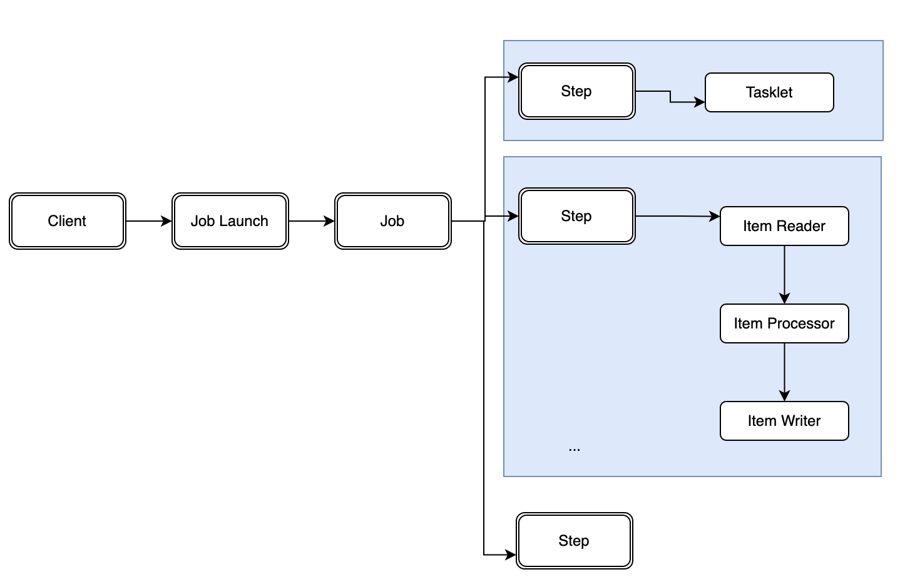

# Spring Batch 기본개념

## 개요

스프링 배치는 Job Launch을 가지고 실행을 하게 됩니다. 그 중에 SimpleJobLaunch를 가지고 실행하게 됩니다. 즉, Sync 의 방식을 가지고 Spring Batch를 실행하게 됩니다. 그러면, Async 방식으로는 Spring Batch를 실행하지 못하나요? 아닙니다. 그 부분은 추후 문서에서 다루게 될 부분이니 기다려 주세요.

## Spring Batch의 실행

위에서 개요를 살펴보다시피 Job Launch를 가지고 Spring Batch를 실행하게 됩니다. 자세한 사항은 아래 그림을 보면서 설명하겠습니다.

위의 그림과 같이 **사용자(Client)**는 **Job Launch를 실행**하게 됩니다. 이 때에 프로그램은 여러 배치(Job)들이 존재하지만, 사용자가 지정한 배치(Job)를 실행하게 됩니다.  

**1개의 배치(Job)**는 **여러 개의 Step**을 가질수 있습니다. 그 이유는 연관된 배치에 대해서 순차적으로 실행할 수 있도록, Step을 나누어 실행시킬수 있습니다. (물론, 순차적인 부분도 있겠지만 예외적인 부분도 존재합니다.)

**1개의 Step**은 **Tasklet 또는 (Item Reader, Item Processor(Optional), Item Writer)을 실행**할 수 있습니다.

**Tasklet**의 경우에는 **하나의 실행으로 끝나는 작업**을 말합니다. 데이터 생성하여 입력한다던가, DB에 조회조건을 통해서 업데이트를 치는 행위 등을 예로 들수 있습니다.

**Item Reader, Item Processor(Optional), Item Writer의 경우**에는 말 그대로 **데이터를 읽고, 가공하여 쓰는 일련의 작업**을 의미합니다.

배치를 가만히 생각해 보자면 다음과 같은 업무가 주를 이룰것입니다.

1. DB에서 읽어서 DB에 쓴다.
2. DB에서 읽어서 File로 쓴다.
3. File에서 읽어서 DB에 쓴다.
4. File에서 읽어서 File로 쓴다.
5. Tasklet과 같이 하나의 실행으로 끝나는 작업

위 5가지 경우의 작업으로 배치가 이루어 지기 때문에 Spring Batch에서는 위의 사항을 interface로 정의해 놓았으며, 그 부분을 Custom하게 사용할 수 있도록 제공하고 있습니다.

## 실습

실습은 저번에 "Spring Batch 시작하기" 글을 참고하셔서 실행을 해 보시기 바랍니다.  
이제는 보이시겠죠? 1개의 Job과 1개의 Step와 1개의 Tasklet을 통해서 배치를 실행할 수 있다는 부분을요.

## 다음시간에는

다음시간에는 프로그램을 만들때 1개의 프로그램에 1개의 배치(Job)만 개발하는 것이 아닙니다. 여러개의 배치를 만들죠. 그럼 어떻게 내가 원하는 배치를 실행할 수 있을까요? 그 부분에 대해서 알아보도록 하겠습니다.
