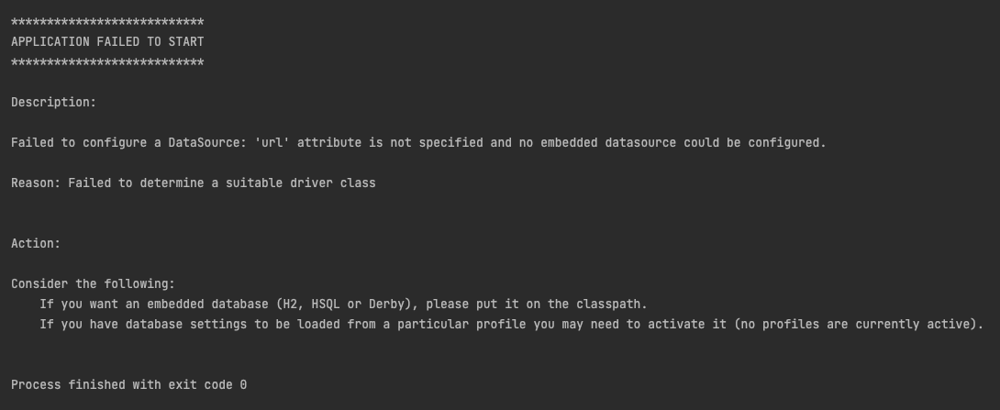

# Spring Batch 실행하기

오늘은 앞에서 말씀드린바와 같이 Spring Batch를 실행하는 방법을 알아보려 합니다.
우선, <https://start.spring.io> 사이트 또는 intelliJ의 Ultimate Version을 사용하신다면 Spring Boot Project를 생성해 보시길 바랍니다.
여기서 중요한 점은 **Spring Batch**를 Dependency로 꼬~옥 체크하셔야 한다는 점입니다.

## Spring Batch Project 생성하기

프로젝트 생성시 간단히 설명을 하기 위해서 하기 4가지만 선택을 하였습니다. Spring Batch를 제외하고는 선택을 하지 않아도 되지만 편의성을 위해서 선택을 하였습니다.

저의 경우에는 프로젝트를 생성할 때, 습관처럼 하는 작업이 있기 때문에 그 작업을 먼저 진행하겠습니다.

1. XXXApplication.java를 App.java로 파일명을 변경합니다.
2. application.properties를 application.yml로 파일명을 변경합니다.

또한, 배치를 실행하기 위해서 다음 작업을 이어나가도록 하겠습니다.

1. job라는 패키지를 생성하였습니다.
2. FirstJob.java 파일을 생성하였습니다.
3. SecondJob.java 파일을 생성하였습니다.

위의 작업한 결과는 다음과 같습니다.

## Spring Batch 시작해보기

- 위에서 만든 App.java 에 **@EnableBatchProcessing**을 추가합니다.

- FirstJob.java을 생성해 보도록 하겠습니다.

- SecondJob.java을 생성해 보도록 하겠습니다.

단순히 FirstJob과 SecondJob 파일은 로그와 파일명만 다른것 뿐입니다. 그리고 App.java를 실행해 보았습니다. 실행결과는 다음과 같이...(흐헉..) 오류가 발생하였습니다.

- 이 부분은 Spring Batch에서 DB를 통해서 배치의 실행결과를 남기는 부분이 존재하는데, DB의 설정이 꼭 필요한 것으로 보입니다. 이에, application.yml을 통해서 테스트로 사용할 H2 DB를 설정해 보겠습니다.

    1. **build.gradle** 파일에서 dependency에 h2를 추가합니다.

    

    2. **application.yml** 파일에서 다음과 같이 설정을 하였습니다.

    

  - 위의 사진에 대한 설명을 하면 다음과 같습니다.
    - spring.batch.jdbc.initialize-schema에는 3가지 (always(항상실행), embedded(내장 DB일시에만 동작), never(항상실행))의 종류가 있습니다. 이 schema의 경우, spring-batch-core.jar에 spring-batch-core-4.3.4.jar!/org/springframework/batch/core/*.sql를 통해서 확인할 수 있으며, DB구조에 따라서 sql파일명이 다른 것을 확인할 수 있습니다. 또한, 기본값은 embedded로 되어 있습니다.

- 그리고 나서 실행을 해 보았더니, 다음과 같이 실행이 완료되었습니다.

- 보셨나요? 모든 Batch가 다 실행되었습니다. 이에, 내가 원하는 Job만 실행시키기 위해서는 다음과 같은 설정을 해 주셔야 합니다.

    1. **application.yml** 파일에서 다음과 같이 설정을 하였습니다.

    

  - 기본적으로 실행시킬 job의 이름을 none으로 하여 job의 이름을 VM Optional로 받을 수 있도록 합니다.  
    이렇게만 하고 실행할 경우에는 다음과 같이 Log가 끝나게 됩니다.

    

  - 이제, 실행할 Job만 선택을 하도록 하겠습니다. 우선 Itellij 기준으로 상단에서 Edit Configurations...을 선택합니다.

    

  - Program Arguments에 **--job.name=FirstJob**에 입력하고, Apply(적용) 후 Close(닫기)를 클릭하여 적용합니다.

        > 만약, Program arguments가 없으시다면 다음과 같이 Modify Options를 클릭하여 Program Arguments를 클릭합니다.

    

    

- 이제 실행을 해 보도록 하겠습니다.

보시면 **FirstJob 실행**의 로그만 표현된 부분을 확인할수 있습니다. 보셨죠?

## 다음시간에는

- Job Parameters에 대해서 알아보도록 하겠습니다.
